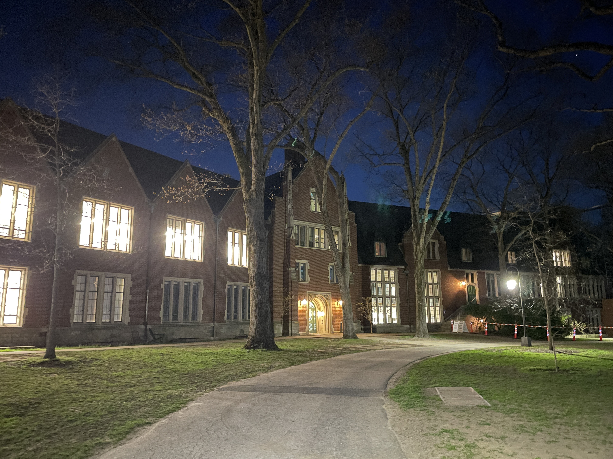
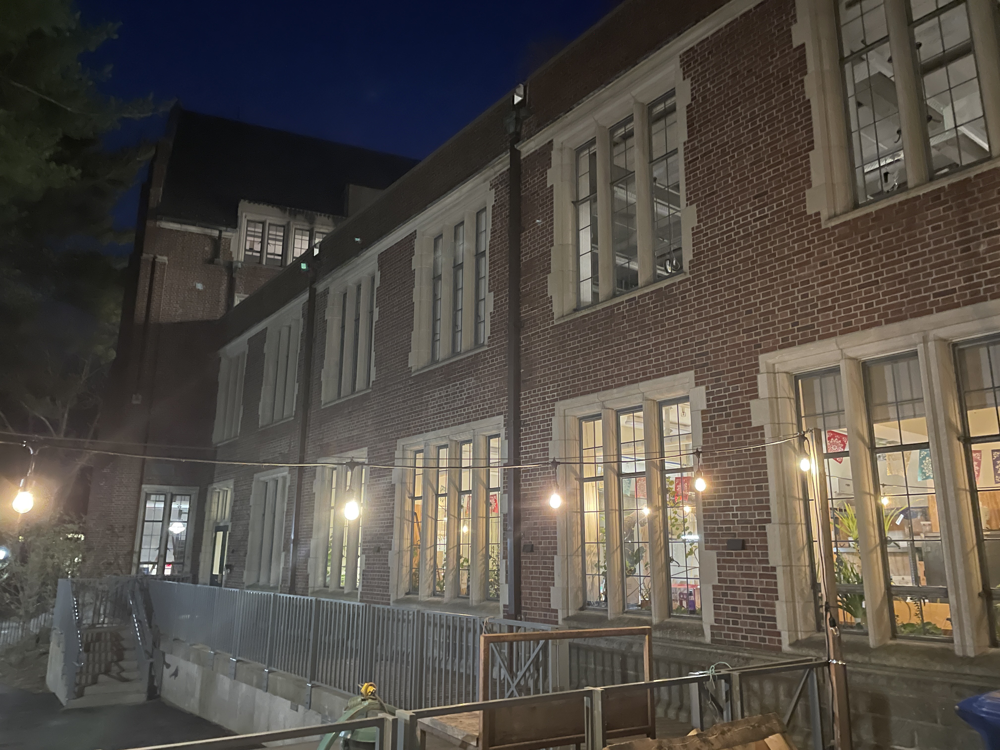
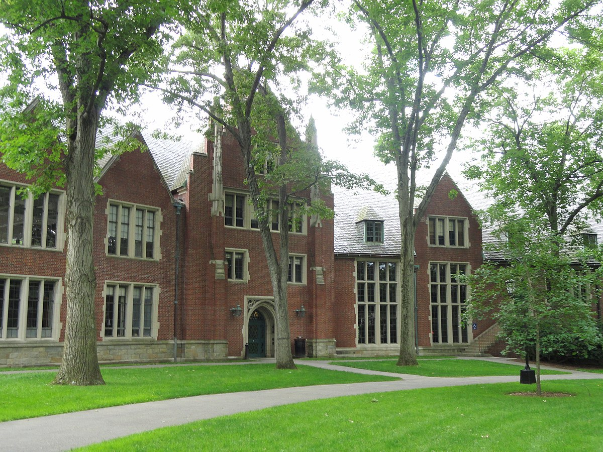
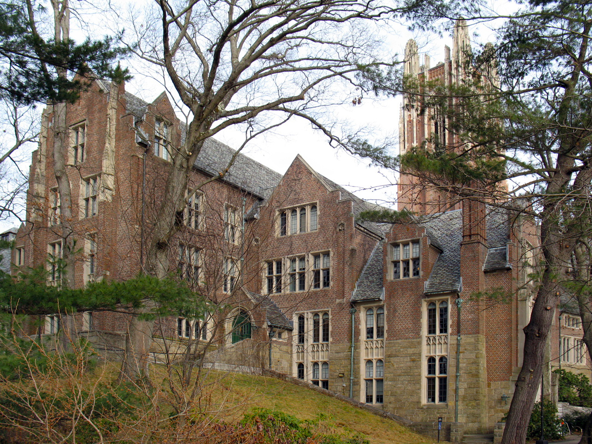
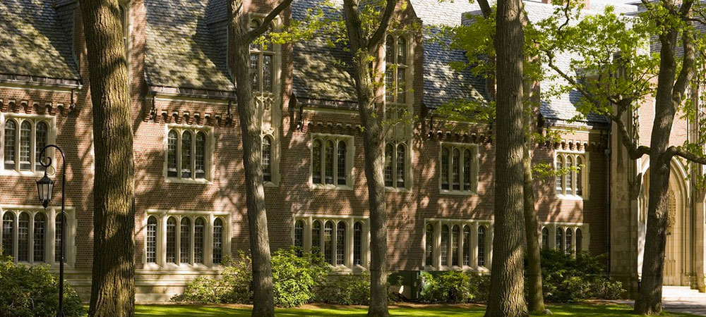

# Pendleton Hall, Wellesley College

### Lily Jiang, Apr 2023

 

Day and Klauder, a firm at the forefront of Collegiate Gothic architecture with their successful designs for Cornell and Princeton, was commissioned in 1916 to design Pendleton Hall for Wellesley College [1]. Implementing their signature Collegiate Gothic style and adhering to a palette of red brick and cream limestone, Day and Klauder created an environment where prestige and tradition define the academic atmosphere.

Pendleton is the final building constructed for the U-shaped plan encircling the top of Norumbega Hill. Composing the northern side of the quad, the building’s shallow V-shape directs students towards the greenery of the lawn, offering prime views of the “natural beauty of Norumbega Hill” and Lake Waban beyond [1].

Originally accommodating the physics, chemistry, and psychology departments, Pendleton’s V-shaped layout intuitively divides it into two wings. Its levels are quite irregular, designed to conform to the natural topography of Norumbega Hill. The interior spaces are a well-executed combination of uplifting Wellesley's potential as a trailblazer in the sciences, and careful consideration of the comfort of those who utilized the spaces.

_Jiang, Lily. April 2023. Pendleton at night. The shallow V-shape can be clearly seen, dividing the building into two wings: Pendleton West and Pendleton East (left and right, respectively)._

 

## Pendleton Hall was originally conceived as part of a plan to create an academic quad at Wellesley.

Since the early 1900s, Wellesley's science departments had expressed a dire need for adequate facilities [1]. After a massive fire in 1914 destroyed College Hall (and most of the physics equipment), the need for these academic buildings increased dramatically, furthering the plan [2]. As part of that plan, Pendleton Hall was intended to house the physics, chemistry, and psychology departments [1].

The Farnsworth Green plan had the goal of creating an administrative and academic center on Norumbega Hill, moving it away from the original College Hall Hill [3]. Many existing structures were demolished for this plan to come to fruition, including the residential Freemam Hall and Wood Cottage, which were destroyed to make room for Pendleton Hall [3].

The first brick was laid in 1934 [4]. In a very symbolic ritual, one member from each of the chemistry, physics, and psychology departments placed the first trowels of mortar with the same silver trowel utilized in buildings for the past 10-20 years [4]. Equally symbolically, Pendleton's cornerstone was a box filled with many symbolic materials, including publications by professors in each department, a Bible, and a picture of the old Chemistry building [4].

Named after Ellen Fitz Pendleton, Wellesley's beloved college president from 1911-1936 and an alum from the class of 1886, the building honors Pendleton’s energy and resources she poured into creating a beautiful and united campus [1].

## Pendleton’s Collegiate Gothic style reinforces the image of a scholarly institution.

To create a cohesive, multi-purpose quad, it was necessary that all the buildings were designed in a style versatile enough to support their various uses. “Diverse and flexible,” Collegiate Gothic was the perfect style [3]. Collegiate Gothic also conveyed tradition and academia, and was thus chosen to express the cultural idea of a scholarly institute.

Pendleton Hall in particular benefited from this style. The tall windows provided ample natural light for work performed in the lab spaces, while the spacious interiors allowed for placing partitions anywhere [2]. Overall, Pendleton is a fantastic blend of form and function, providing a beautiful, versatile, and practical space for scientific pursuits.

_Jiang, Lily. April 2023. The backside of Pendleton West. The windows are tall and in groups of 2-4, which allow a lot of light to stream through during the daytime._

 

Collegiate Gothic also supported “irregular and spontaneous” topography, a necessity as all the buildings were situated on the brow (rather than the flat plateau) of Norumbega Hill [3]. Carefully fitted to the contour of the hill, the north side of Pendleton is 3-4 floors while the south side is 2-3 floors [1].

As the last building within the quad to be constructed, not much budget was left for Pendleton Hall. To cut costs down by almost half, Pendleton’s exterior was designed with less ornamentation than other buildings within the quad [1]. The windows are entirely rectangular, while other buildings also include arched and lancet-like windows. Pinnacles, tracery, and other decoration were removed from Pendleton’s final design, which is evident particularly when comparing it with Green Hall [1].

  

    
  

  

    
  

  

    
  

  

    
[9]

  

  

    
[10]

  

  

    
[11]

  

_In this side by side comparison, Founders Hall (middle) has arched windows and Green Hall (right) has pointed arched windows, while Pendleton (left) has only rectangular windows._

 

## Materials were rigorously and thoughtfully chosen to ensure a long-lasting building.

Red brick is one of the distinguishing characteristics of Wellesley’s academic quad, visually uniting the buildings as a common element. At the advice of Professor Voss at MIT (an expert in construction methods), Pendleton’s water-struck, body-red brick was chosen through a rigorous process [5]. Over 100 bricks were tested for an ideal absorption of 5% in 48 hours [5].

Complementing the red brick, cream-colored Indiana limestone was chosen to complete the facade [1]. Pendleton’s copings, window surrounds, entrance surrounds, and various other trim all consist of this material.

<!-- talk a bit more about this. and can even talk about the shale and metal in the roof -->

Overall, much emphasis was placed upon choosing the materials Pendleton was constructed from to ensure the building was durable and long-lasting. Today, many decades after its construction, Pendleton’s facade remains visibly well-maintained, a testament to the forethought and intentionality that went into its design.

## In planning the building, it was remembered that “humans are more precious than equipment”.

<!-- that quote above is from the publicity office -->

Designed as an academic building, Pendleton’s interior was specifically curated to cater to Wellesley’s innovative academic program. The design also prioritized the comfort of the people utilizing the space. Planning Pendleton involved 3 principles: convenience of arrangement, completeness of equipment, and comfort of the users [2].

As one of the pioneers in physics education (Wellesley was one of the first colleges to offer a lab-based physics curriculum), much emphasis was placed on the physical equipment available to students [2]. From the apparatus rooms designed with convenience in mind to the impressive electrical distribution system servicing all uses in all rooms, the physics department was well-suited to support innovation [2].

Each of the wings in Pendleton were designed specific to their purposes in the following ways [2]:

| Pendleton West (Chemistry) | Pendleton East (Physics/Psychology) |
|----------------------------|------------------------------------|
| 2 large fans in the attic for pumping fumes | Acoustic ceiling tiles in various rooms |
| Acid-proof finishes on all tables and cabinets | Bottom floor has machine/wood shops, dark rooms, glass blowing shop, and cooler stuff |
| Chemical labs on the top floor for efficient fume removal | Electric system: large distribution board in the basement, used both for the actual infrastructure of the building and for electricity experiments |
| Stock rooms on every floor are in the same place, serviced by an elevator | Meteorology equipment and labs on the 2nd floor |

But beyond the wealth of knowledge and tools available, Pendleton's design is notable for prioritizing the human experience of being in the rooms. Some notable accomodations are [2]:

* Posture chairs, deemed comfortable by 9/10 people and chosen after testing 57 types of chairs
* Sanacoustic tiles in ceilings throughout
* Forced ventilation in lecture halls to prevent drowsiness
* Dimmable lights for easing eye strain
* Blackboards and shades were motor-driven

## Pendleton today serves vastly different purposes than during its founding 80+ years ago.

Nowadays, Pendleton is not occupied by any science departments. The construction of the Science Center in 1977 resulted in the relocation of the physics and chemistry departments [1]. Replacing these vacancies were social sciences and humanities in Pendleton East, and various arts in Pendleton West. The original benefits of the Collegiate Gothic style for lab spaces applied easily to the new art studios, as the windows provide ample natural light and the ability to partition the space allowed for well-sized studios.

Completed in 2017, renovation plans for Pendleton West converted the original lab spaces into art studios and spaces [6]. This renovation included a modern addition to the original wing, with large floor-to-ceiling windows, exposed concrete walls, and wood accents. But most importantly, the addition involved a sky bridge connecting the arts of Pendleton West to the arts of Jewett, effectively unifying the two and pushing for overlaps in curriculum [7].

In Spring 2022, after years of failing HVAC systems that would flood offices and destroy important items, Pendleton East was closed down for "critical repairs" [8]. As of April 2023, this half of Pendleton is still closed, forcing the social sciences/humanities departments to operate out of temporary modular buildings [8]. I haven't been able to find any information about when the projected finish date is.

## Sources
<!-- chicago style -->

<!-- manuscript? -->
1. Schuler, Gretchen. _Pendleton Hall Physics & Chemistry Building_. Inventory Form Continuation Sheet. Boston: Massachusetts Historical Commission, March 1989. From Wellesley College Archives, Buildings, Wellesley College Area A #1-5.
<!-- Last name, First name Middle initial. _Title of Work_. Format. City: Publishing Company, copyright date. Source, Collection. Medium, http://...(accessed date). -->

<!-- journal article -->
2. McDowell, Louise S. "Physics at Wellesley." American Journal of Physics 91 No. 4 (May 1, 1936): 57–61. https://doi.org/10.1119/1.1999067.
<!-- Last name, First name. "Title of Article." Title of Journal volume number, no. issue number (year): page numbers. -->

<!-- manuscript? -->
3. Schuler, Gretchen. _Academic Quadrangle_. Inventory Form Continuation Sheet. Boston: Massachusetts Historical Commission, March 1989. From Wellesley College Archives, Buildings, Wellesley College Area A #1-5.

<!-- manuscript? -->
4. _Cornerstone Ceremonies: Pendleton Hall - Monday, December 3, 1934._ Newspaper. Wellesley: Office of Publicity, December 3, 1934. From Wellesley College Archives, President's Office, Pendleton Hall (1934-38).

<!-- manuscript -->
5. Hodges, C.B. _Leaky Buildings, January 23, 1934_. Letter. Wellesley: Office of the Business Manager at Wellesley College, January 23, 1934. From Wellesley College Archives, President's Office, Pendleton Hall (1934-38).

<!-- website -->
6. "Pendleton West Reopens as New Collaborative Arts Center." Spotlight on Wellesley. October 19, 2017. Accessed April 24, 2023. https://www.wellesley.edu/news/2017/node/131246.

<!-- website -->
7. "Pendleton West Renovation and Addition." Kieran Timberlake. Accessed April 24, 2023. https://kierantimberlake.com/page/pendleton-west.

<!-- website -->
8. Valida Pau. "Pendleton East Closure Displaces Social Science Departments." The Wellesley News. February 8, 2023. Accessed April 24, 2023. https://thewellesleynews.com/2023/02/08/pendleton-east-closure-displaces-social-science-departments/.

<!-- online image -->
9. Daderot. Pendleton Hall - Wellesley College. July 2, 2011. Wikipedia, https://en.wikipedia.org/wiki/File:Pendleton_Hall_-_Wellesley_College_-_DSC09683.JPG. Accessed April 24, 2023.
<!-- Last name, First name of the creator. Title of the Image. Year Created. Medium. Website Name, URL. Accessed Date. -->

<!-- online image -->
10. Pettit, Betsy & Peter Baker. Wellesley College Founders Hall. Building Science, https://buildingscience.com/project/wellesley-college-founders-hall. Accessed April 24, 2023.

<!-- online image -->
11. Wellesley College Administration, https://www.wellesley.edu/administration/offices. Accessed April 24, 2023.

<!-- TODO: 
* verify the info in source #3 is correct. i just copied it from source 1 bc i don't have a pic of the first page -->
