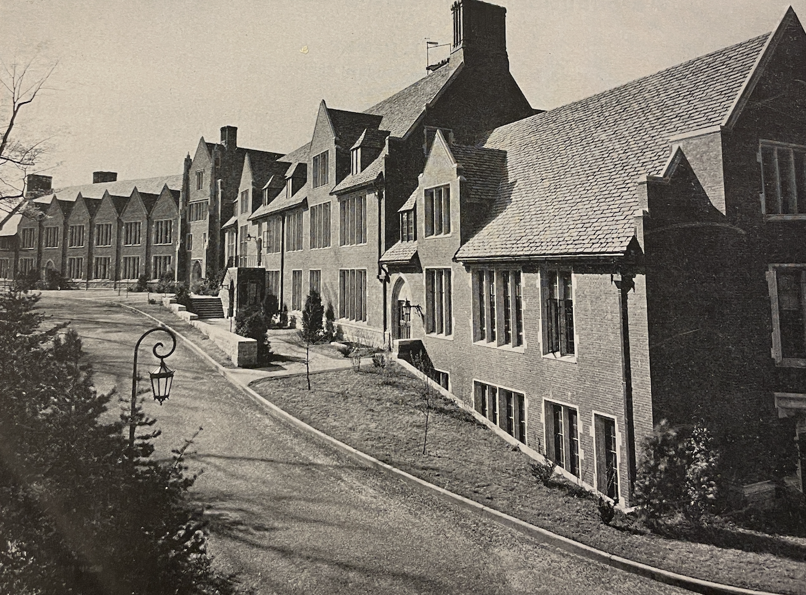
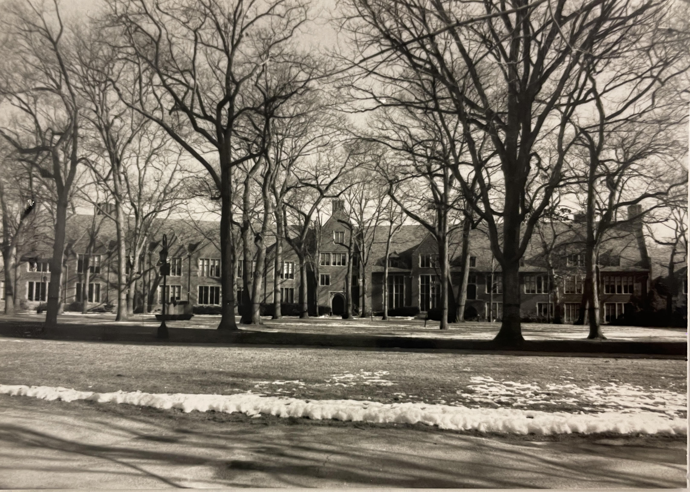
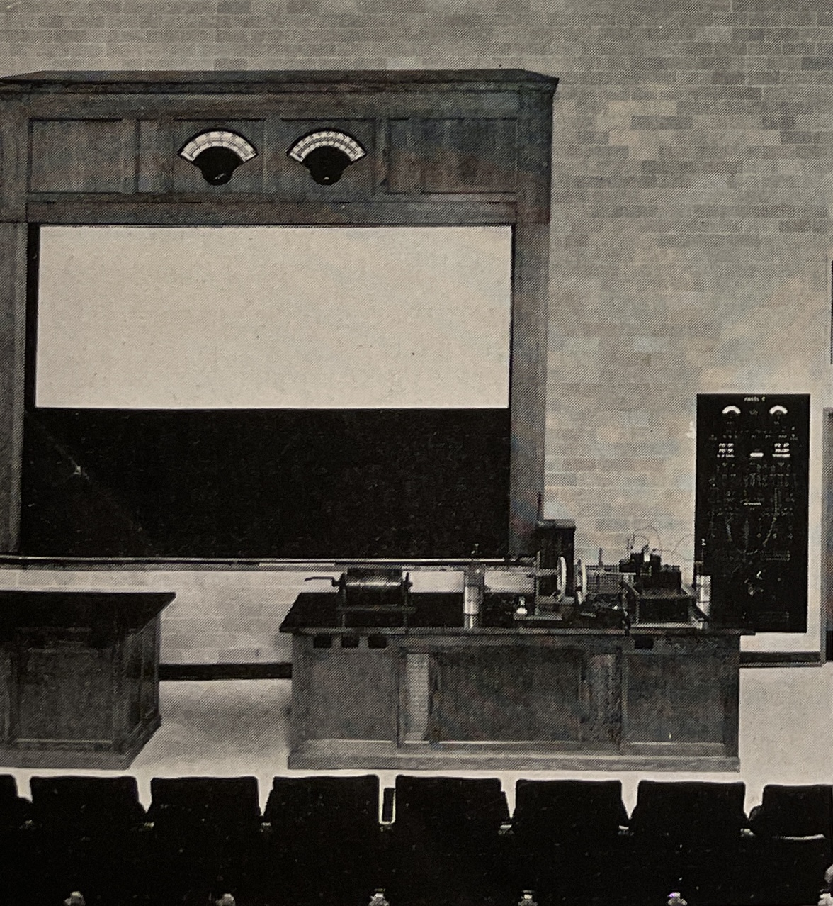
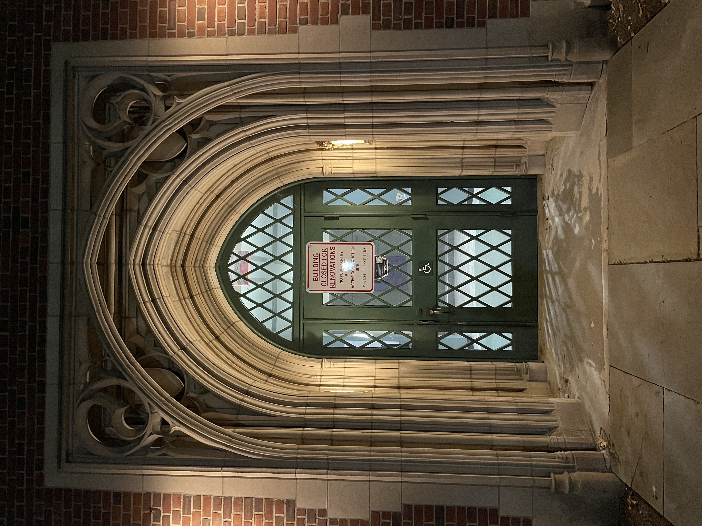

<!-- MD version for easier editing and simpler website -->

# Pendleton Hall, Wellesley College

### Lily Jiang, April 2023

Day and Klauder, a firm behind many successful Collegiate Gothic designs for Cornell and Princeton, was commissioned in 1916 to design Pendleton Hall for Wellesley College [1]. Implementing their signature Collegiate Gothic style and adhering to a palette of red brick and cream limestone, Day and Klauder created an environment where prestige and tradition define the academic atmosphere.

Pendleton is the final building constructed for the U-shaped plan encircling the top of Norumbega Hill. Composing the northern side of the quad, the building’s shallow V-shape directs students towards the greenery of the lawn, offering prime views of the “natural beauty of Norumbega Hill” and Lake Waban beyond [2].

Originally accommodating the physics, chemistry, and psychology departments, Pendleton’s V-shaped layout intuitively divides it into two wings. Its levels are quite irregular, designed to conform to the natural topography of Norumbega Hill. The interior spaces are a well-executed combination of uplifting Wellesley's potential as a trailblazer in the sciences, and careful consideration of the comfort of those who utilized the spaces.

_Jiang, Lily. April 2023. Pendleton at night. The shallow V-shape can be clearly seen, dividing the building into two wings: Pendleton West and Pendleton East (left and right, respectively)._

 

## Pendleton Hall was originally conceived as part of a plan to create an academic quad at Wellesley.

Since the early 1900s, Wellesley's science departments had expressed a dire need for adequate facilities [3]. After a massive fire in 1914 destroyed College Hall (and most of the physics equipment), the need for these academic buildings increased dramatically, furthering the plan [4]. As part of that plan, Pendleton Hall was intended to house the physics, chemistry, and psychology departments [5].

The Farnsworth Green plan had the goal of creating an administrative and academic center on Norumbega Hill, moving it away from the original College Hall Hill [6]. As noted in the Inventory Form for the Academic Quad, many existing structures were demolished for this plan to come to fruition. In particular, the residential Freemam Hall and Wood Cottage were destroyed to make room for Pendleton Hall.

Documented by Wellesley's Office of Publicity in their "Cornerstone Ceremonies" series, the first brick of Pendleton was laid in 1934 [4]. In a very symbolic ritual, one member from each of the chemistry, physics, and psychology departments placed the first trowels of mortar with the same silver trowel utilized in buildings for the past 10-20 years. Equally symbolically, Pendleton's cornerstone was a box filled with many symbolic materials, including publications by professors in each department, a Bible, and a picture of the old Chemistry building [7].

Pendleton Hall is named after Ellen Fitz Pendleton, Wellesley's beloved college president from 1911-1936 and an alum from the class of 1886. The building honors the sheer amount of energy and resources Pendleton poured into creating a beautiful and united campus [8].

 

## Pendleton’s Collegiate Gothic style reinforces the image of a scholarly institution.

To create a cohesive, multi-purpose quad, it was necessary that all the buildings were designed in a style versatile enough to support their various uses. The Academic Quad Inventory Form deems Collegiate Gothic as "diverse and flexible," rendering it the perfect style for the quad. Collegiate Gothic also conveyed tradition and academia, and was thus chosen to express the cultural idea of a scholarly institute.

Pendleton Hall in particular benefited from this style. The tall windows provided ample natural light for work performed in the lab spaces, while the spacious interiors allowed for placing partitions anywhere [9]. Overall, Pendleton is a fantastic blend of form and function, providing a beautiful, versatile, and practical space for scientific pursuits.

_Image from the Wellesley College Archives [10]. Pendleton West, as seen from the East side. The tall rectangular windows, in groups of 2-4, are one of the more prominent features of the building._

 

Collegiate Gothic also supported irregular, spontaneous topography. This was a necessity since, as mentioned in the Academic Quad's Inventory Form, all of the buildings were situated on the brow of Norumbega Hill rather than the flat plateau. Carefully fitted to the contour of the hill, the north side of Pendleton is 3-4 floors while the south side is 2-3 floors [11].

The Inventory Form (for Pendleton Hall specifically) points out that as the last building within the quad to be constructed, Pendleton didn't recieve much budget. To cut costs down by almost half, Pendleton's exterior was designed with less ornamentation than other buildings within the quad. The windows are entirely rectangular, while other buildings also include arched and lancet-like windows. Pinnacles, tracery, and other decoration were removed from the building's final design, which is evident particularly when comparing it with Green Hall.

  

    
  

  

    
  

  

    
  

  

    
[12]

  

  

    
[13]

  

  

    
Jiang, Lily. April 2023.

  

  
In this side by side comparison, Founders Hall (middle) has arched windows and Green Hall (right) has pointed arched windows, while Pendleton (left) has only rectangular windows.

 

## Materials were rigorously and thoughtfully chosen to ensure a long-lasting building.

Red brick is one of the distinguishing characteristics of Wellesley’s academic quad, visually uniting the buildings as a common element. At the advice of Professor Voss at MIT (an expert in construction methods), Pendleton’s water-struck, body-red brick was chosen through a rigorous process. In a letter to President Pendleton, Voss specifically recommended testing over 100 bricks for an ideal absorption of 5% in 48 hours.

To complement the red brick, cream-colored Indiana limestone was chosen to complete the facade [14]. Pendleton’s copings, window surrounds, entrance surrounds, and various other trim all consist of this material.

<!-- talk a bit more about this. and can even talk about the shale and metal in the roof -->

Overall, much emphasis was placed upon choosing the materials Pendleton was constructed from to ensure the building was durable and long-lasting. Today, many decades after its construction, Pendleton’s facade remains well-maintained, a testament to the forethought and intentionality that went into its design.

 

  

    
  

  

    
  

  

    
Pendleton Hall, 1989. Image from the Pendleton Hall Inventory Form [15]. Wellesley College Archives.

  

  

    
Pendleton Hall, 2023. Image from Lily Jiang. The facade is pretty much identical to the 1989 picture.

  

 

## In planning the building, it was remembered that “humans are more precious than equipment” [16].

Designed as an academic building, Pendleton’s interior was specifically curated to cater to Wellesley’s innovative academic program. The design also prioritized the comfort of the people utilizing the space. According to physics professor Louise McDowell's publication about Pendleton's physics facilities, planning Pendleton involved 3 principles: convenience of arrangement, completeness of equipment, and comfort of the users [17].

As one of the pioneers in physics education (McDowell noted that Wellesley was one of the first colleges to offer a lab-based physics curriculum), much emphasis was placed on the physical equipment available to students. From the apparatus rooms designed with convenience in mind to the impressive electrical distribution system servicing all uses in all rooms, the physics department was well-suited to support innovation.

McDowell's discussion of Pendleton points out the specific features of each wing, designed for their respective purposes:

 

| Pendleton West (Chemistry)                                                | Pendleton East (Physics/Psychology)                                                                                                                |
| ------------------------------------------------------------------------- | -------------------------------------------------------------------------------------------------------------------------------------------------- |
| 2 large fans in the attic for pumping fumes                               | Acoustic ceiling tiles in various rooms                                                                                                            |
| Acid-proof finishes on all tables and cabinets                            | Bottom floor has machine/wood shops, dark rooms, glass blowing shop, and cooler stuff                                                              |
| Chemical labs on the top floor for efficient fume removal                 | Electric system: large distribution board in the basement, used both for the actual infrastructure of the building and for electricity experiments |
| Stock rooms on every floor are in the same place, serviced by an elevator | Meteorology equipment and labs on the 2nd floor                                                                                                    |

 

But beyond the wealth of knowledge and tools available, Pendleton's design is notable for prioritizing the human experience of being in the rooms. Some notable accomodations that McDowell notes are:

* Posture chairs, deemed comfortable by 9/10 people and chosen after testing 57 types of chairs
* Sanacoustic tiles in ceilings throughout
* Forced ventilation in lecture halls to prevent drowsiness
* Dimmable lights for easing eye strain
* Blackboards and shades were motor-driven

 

_Image from the Wellesley College Archives [18]. A motorized blackboard is utilized at the front of the lecture hall. To the right is the electric panel for the room, connected to the distribution board._

 

## Pendleton today serves vastly different purposes than during its founding 80+ years ago.

Nowadays, Pendleton is not occupied by any science departments. The construction of the Science Center in 1977 resulted in the relocation of the physics and chemistry departments [19]. Replacing these vacancies were social sciences and humanities in Pendleton East, and various arts in Pendleton West. The original benefits of the Collegiate Gothic style for lab spaces applied easily to the new art studios, as the windows provide ample natural light and the ability to partition the space allowed for well-sized studios.

Completed in 2017, renovation plans for Pendleton West converted the original lab spaces into art studios and spaces [20]. This renovation included a modern addition to the original wing, with large floor-to-ceiling windows, exposed concrete walls, and wood accents. But most importantly, the addition involved a sky bridge connecting the arts of Pendleton West to the arts of Jewett, effectively unifying the two and pushing for overlaps in curriculum [21].

According to The Wellesley News, Pendleton East was closed down in Spring 2022 for "critical repairs" to the failing HVAC systems. As of April 2023, this half of Pendleton is still closed, forcing the social sciences/humanities departments to operate out of temporary modular buildings [22].

 

_Jiang, Lily. April 2023. Pendleton's central door. A sign informs that the central and eastern portions of Pendleton Hall are closed for renovations. These closures are part of an effort to repair failing HVAC systems._

 

Overall, Pendleton Hall is a remarkable example of how architecture can affect the academic experience by providing beautiful and functional spaces for learning, studies, and research. Despite originally being constructed with a limited budget, Pendleton remains well-maintained and visually impressive due to the sheer amount of careful planning that went into its design. And as a beautiful example of Collegiate Gothic architecture, Pendleton continues to uphold the distinguished academic environment of Wellesley College today as an arts, social sciences, and humanities academic building.

 

## Sources
<!-- chicago style -->

1. Schuler, Gretchen. _Pendleton Hall Physics & Chemistry Building_. Inventory
   Form Continuation Sheet, page 1. Boston: Massachusetts Historical
   Commission, March 1989. From Wellesley College Archives, Library and
   Technology Services, Buildings, Wellesley College Area A #1-5.
2. Schuler, Gretchen. _Pendleton Hall Physics & Chemistry Building_. Inventory
   Form Continuation Sheet, page 1. Boston: Massachusetts Historical
   Commission, March 1989. From Wellesley College Archives, Library and
   Technology Services, Buildings, Wellesley College Area A #1-5.
3. Schuler, Gretchen. _Pendleton Hall Physics & Chemistry Building_. Inventory
   Form Continuation Sheet, page 2. Boston: Massachusetts Historical
   Commission, March 1989. From Wellesley College Archives, Library and
   Technology Services, Buildings, Wellesley College Area A #1-5.
4. McDowell, Louise S. "Physics at Wellesley." American Journal of Physics 91
   No. 4 (May 1, 1936): 57–61. https://doi.org/10.1119/1.1999067.
5. Schuler, Gretchen. _Pendleton Hall Physics & Chemistry Building_. Inventory
   Form Continuation Sheet, cover page. Boston: Massachusetts Historical
   Commission, March 1989. From Wellesley College Archives, Library and
   Technology Services, Buildings, Wellesley College Area A #1-5.
6. Schuler, Gretchen. _Academic Quadrangle_. Inventory Form Continuation Sheet,
   page 4. Boston: Massachusetts Historical Commission, March 1989. From
   Wellesley College Archives, Library and Technology Services, Buildings,
   Wellesley College Area A #1-5.
7. _Cornerstone Ceremonies: Pendleton Hall - Monday, December 3, 1934._
   Newspaper. Wellesley: Office of Publicity, December 3, 1934. From Wellesley
   College Archives, Library and Technology Services, President's Office,
   Pendleton Hall (1934-38).
8. Schuler, Gretchen. _Pendleton Hall Physics & Chemistry Building_. Inventory
   Form Continuation Sheet, page 2. Boston: Massachusetts Historical
   Commission, March 1989. From Wellesley College Archives, Library and
   Technology Services, Buildings, Wellesley College Area A #1-5.
9. McDowell, Louise S. "Physics at Wellesley." American Journal of Physics 91
   No. 4 (May 1, 1936): 57–61. https://doi.org/10.1119/1.1999067.
10. Walsh, Elizabeth B. _Pendleton Hall, Wellesley College_. Newspaper
   article. From Wellesley College Archives, Library and Technology Services,
   Publicity Office, Buildings: Pendleton (1934-36).
11. Schuler, Gretchen. _Pendleton Hall Physics & Chemistry Building_. Inventory
   Form Continuation Sheet. Boston: Massachusetts Historical Commission, March
   1989. From Wellesley College Archives, Library and Technology Services,
   Buildings, Wellesley College Area A #1-5.
12. Pettit, Betsy & Peter Baker. Wellesley College Founders Hall. Building
   Science, https://buildingscience.com/project/wellesley-college-founders-hall.
   Accessed April 24, 2023.
13. Wellesley College Administration, https://www.wellesley.edu/administration/offices.
   Accessed April 24, 2023.
14. McDowell, Louise S. "Physics at Wellesley." American Journal of Physics 91
   No. 4 (May 1, 1936): 57–61. https://doi.org/10.1119/1.1999067.
15. Schuler, Gretchen. _Pendleton Hall Physics & Chemistry Building_. Inventory
  Form Continuation Sheet. Boston: Massachusetts Historical Commission, March
  1989. From Wellesley College Archives, Library and Technology Services,
  Buildings, Wellesley College Area A #1-5.
16. McDowell, Louise S. "Physics at Wellesley." American Journal of Physics 91
  No. 4 (May 1, 1936): 57–61. https://doi.org/10.1119/1.1999067.
17. McDowell, Louise S. "Physics at Wellesley." American Journal of Physics 91
  No. 4 (May 1, 1936): 57–61. https://doi.org/10.1119/1.1999067.
18. Walsh, Elizabeth B. _Pendleton Hall, Wellesley College_. Newspaper article.
  From Wellesley College Archives, Library and Technology Services, Publicity
  Office, Buildings: Pendleton (1934-36).
19. Schuler, Gretchen. _Pendleton Hall Physics & Chemistry Building_. Inventory
  Form Continuation Sheet. Boston: Massachusetts Historical Commission, March 1989.
  From Wellesley College Archives, Library and Technology Services, Buildings,
  Wellesley College Area A #1-5.
20. "Pendleton West Reopens as New Collaborative Arts Center." Spotlight on
   Wellesley. October 19, 2017. Accessed April 24, 2023.
   https://www.wellesley.edu/news/2017/node/131246.
21.  "Pendleton West Renovation and Addition." Kieran Timberlake. Accessed April 24, 2023. https://kierantimberlake.com/page/pendleton-west.
22.  Valida Pau. "Pendleton East Closure Displaces Social Science Departments." The Wellesley News. February 8, 2023. Accessed April 24, 2023. https://thewellesleynews.com/2023/02/08/pendleton-east-closure-displaces-social-science-departments/.
