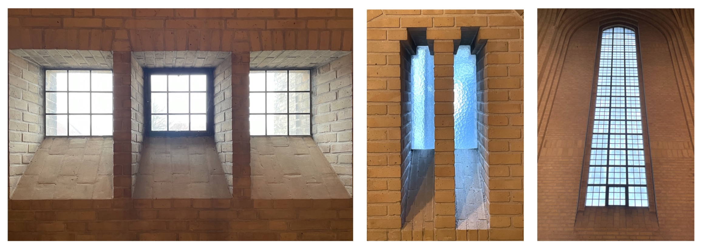
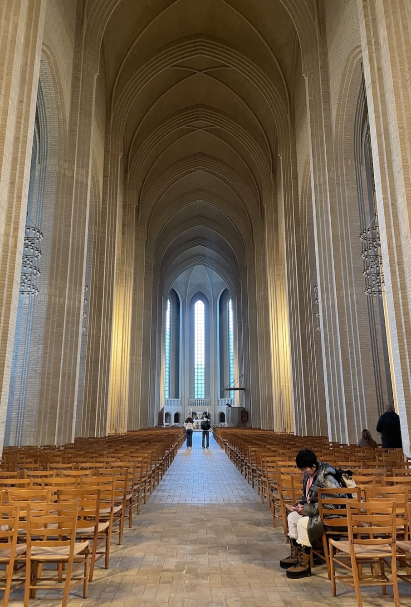
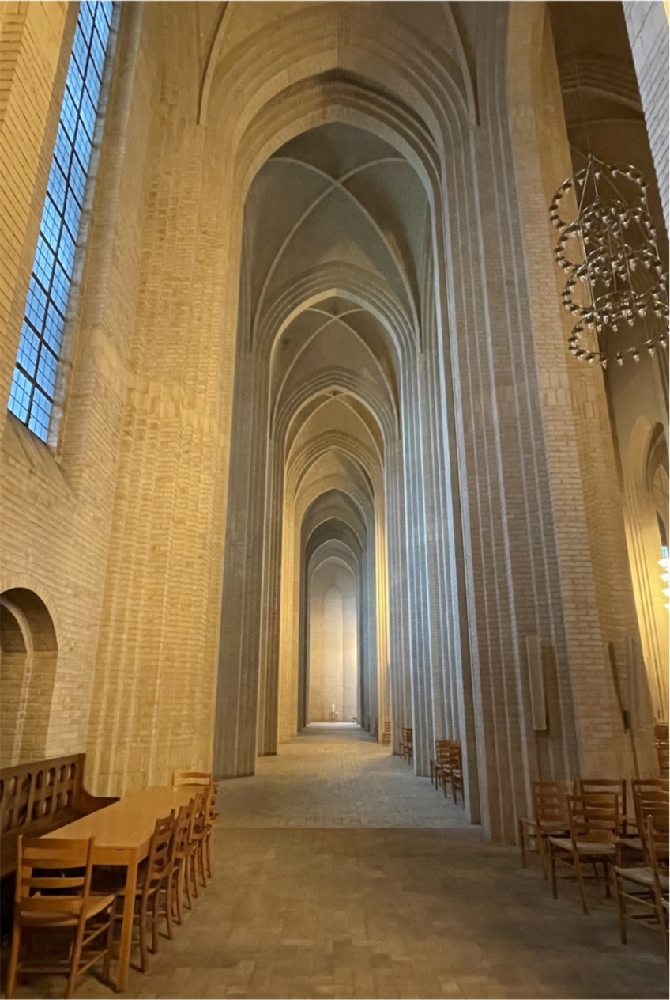
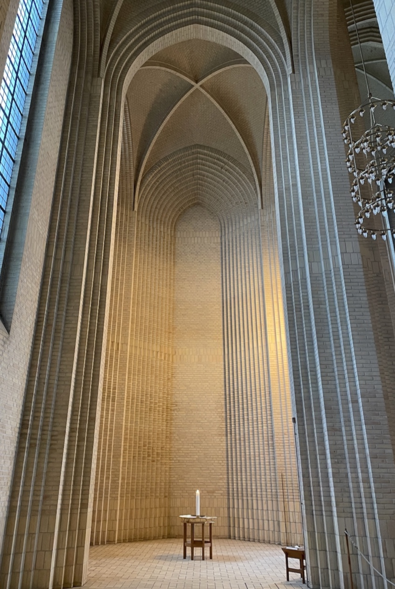
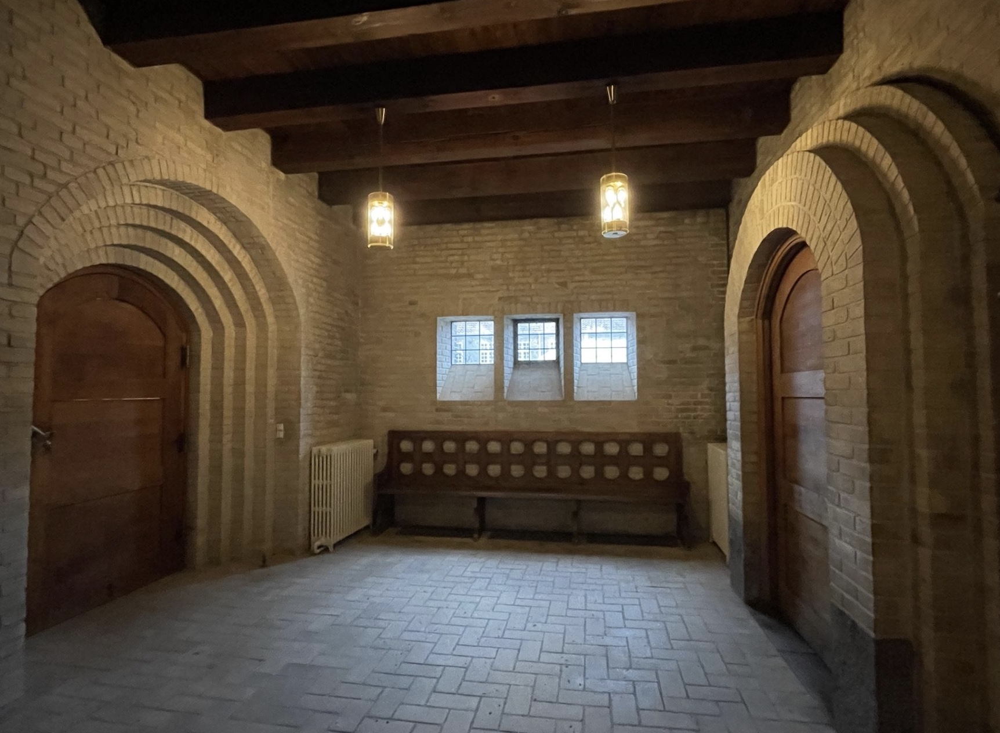
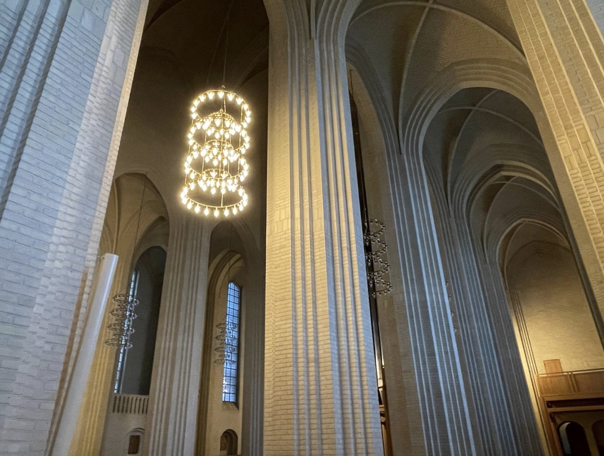

<!-- MD version for easier editing and simpler website -->

# Grundtvig's Church, Copenhagen

### Lily Jiang, February 2024

Just northwest of Copenhagen’s city center is a masterpiece called Grundtvig’s
Church. Designed by Peder Vilhelm Jensen-Klint as a memorial to NFS Grundtvig,
it is a monument to Danish architecture and culture. With Erik Nygaard’s
framework, Grundtvig’s Church is best understood through analyzing its pure form
(Nygaard 2011). By exploring how Jensen-Klint manipulates natural and artificial
light, implements Gothic features, and utilizes a limited palette of materials,
his intended effects with the space are revealed.

The visual impact of Grundtvig’s church comes from its form, particularly with
how it harnesses light. Within religious spaces, light “manifests a sense of
spirituality” (Matracchi and Habibabad 2022). Similarly, Jensen-Klint utilizes
natural light to accentuate the proportions of the space, with the intention of
instilling a profound sense of wonder within the onlooker. Nordic sunlight,
known for its low angle, casts near-horizontal sunbeams. It is clear that
Jensen-Klint designed with this in mind, as the windows are tapered on the
bottom edge to allow more sunlight to penetrate the room (Fig. 1). This results
in a gentle, diffused illumination that complements the angular, vertical form
of the church to dramatize the space.

_Fig. 1: Tapered windows throughout the church. (Image by the author)_

 

Jensen-Klint also employs light to draw the viewer’s attention to important
areas within the church. He strategically placed large, closely-spaced windows
in the apse, ensuring it is the most radiant section of the church (Fig. 2).
Moreover, he oriented the church towards the east, taking advantage of the sun’s
position in the sky to illuminate morning church services. In this way,
Jensen-Klint plays upon human tendencies to gravitate towards the light,
enticing onlookers to journey down the length of the nave towards the altar.

_Fig. 2: The apse is the most illuminated area within the church at 11am. (Image
by the author)_

In addition to natural light, the design also allows artificial light to
contribute to the space through chandeliers along the nave’s length. Beyond
ensuring the massive space remains properly illuminated in the limited sunlight,
the warm-toned light bulbs present an alternative atmosphere to the cool blue of
the natural light. Additionally, the warm glow brings out the natural yellow
color of the bricks, emphasizing the humble material from which the church is
constructed. As each chandelier is controlled individually, the different
lighting experiences can be curated within the space. In Fig. 3, the end of the
aisle is illuminated, inviting the viewer to stroll the length of it and admire
how the light strikes the brick pattern on the wall (Fig. 4). This is yet
another example of how Jensen-Klint uses light to influence the viewer’s
attention.

_Fig. 3: The chandeliers create a warm yellow color throughout the space. (Image
by the author)_

_Fig. 4: The bricks form an interesting pattern at the end of the aisle. (Image
by the author)_

The abundance of light within the church is heavily juxtaposed by the narthex
(Fig. 5). This serves to heighten the impact of viewing the church for the first
time, as the viewer transitions from the dimly-lit, confined narthex to be
greeted by an expansive, light-filled room. In this way, it is apparent that
light is crucial to the viewer’s experience, culminating in an extraordinarily
beautiful space that is unique to Grundtvig’s Church.

_Fig. 5: The narthex of Grundtvig’s Church is lit only by a few small windows
and ceiling lamps. (Image by author)_

The impact of light within the space is also closely linked to the church’s
Gothic form. Grundtvig’s Church’s pointed arches, vaulted ceilings, and vertical
proportions closely resemble traditional Gothic architecture. By embracing this
well-established style, Jensen-Klint creates a grandiose space that instills the
same “awe of God” and “transcendental psychological effect” that Gothic churches
are renowned for (Yan and Sun 2018). It is evident he wanted to ensure religion
remained at the forefront of the design, supported but not overshadowed by the
beauty of the interior to define Grundtvig’s Church as a “sacred space”
(Pedersen).

It is also essential to note the homogeneity and simplicity of the church,
primarily constructed from a single material and mostly devoid of ornamentation.
Upon closer inspection, the apparent complexity of many features are often
revealed to be simple patterns. For example, the columns have an intricate,
layered look that is actually just a product of a simple geometric repetition
(Fig. 6).

_Fig. 6: The columns of Grundtvig’s church are intricate-looking, yet are
composed only of simple geometries. (Image by author)_

This presents an interesting juxtaposition where repetition and simplicity can
be used to create complex and grandiose forms. The yellow brick material
represents the vernacular Danish culture, a “humble, everyday building material”
that matches the adjacent buildings (Pedersen). The choice of material embodies
“an appreciation of the simple, inconspicuous and modest” that was so central to
NFS Grundtvig’s philosophies (Munch 2019).

By applying Nygaard’s lenses on observing architecture through their pure form,
Grundtvig’s Church can easily be explained through how it harnesses light, its
stunning Gothic features, and the humble brick material. These, in turn, reveal
Jensen-Klint’s intentions to create an awe-inspiring experience for viewers of
the space, reflective of both God and of local Danish culture simultaneously.

## Sources

1. Nygaard, Erik. (2011). “Introduction”. In Architecture Understood
   (Introduction), translated by Henning Thomsen, 8-11. Copenhagen: Bogværket.

2. Matracchi, Pietro and Ali Sadeghi Habibabad. (2022). “Prioritising the effect
   of ‘Light’ in the religious places and environments with an emphasis on the
   sense of spirituality”. In Ain Shams Engineering Journal, 13(1).
   https://doi.org/10.1016/j.asej.2021.05.028

3. Yan, Liang and Zhenzhen Sun. (2018). “The Religious Fanaticism and ‘Odd
   Coincidences’ of Gothic Architectural Art”. In Advances in Social Science,
   Education and Humanities Research (ASSEHR), volume 199.
   https://doi.org/10.2991/saeme-18.2018.59

4. Pedersen, Thomas Viggo. (n.d.). About the Church and Opening Hours |
   Grundtvigs Kirke. [online] Available at:
   https://www.grundtvigskirke.dk/kirken/about-the-church-.

5. Munch, Asser. (2019). Grundtvig’s Church by P. V. Jensen-Klint ⋆ Copenhagen
   Architecture. [online] Copenhagen Architecture. Available at:
   https://copenhagenarchitecture.dk/grundtvigs-church-by-p-v-jensen-klint/.
